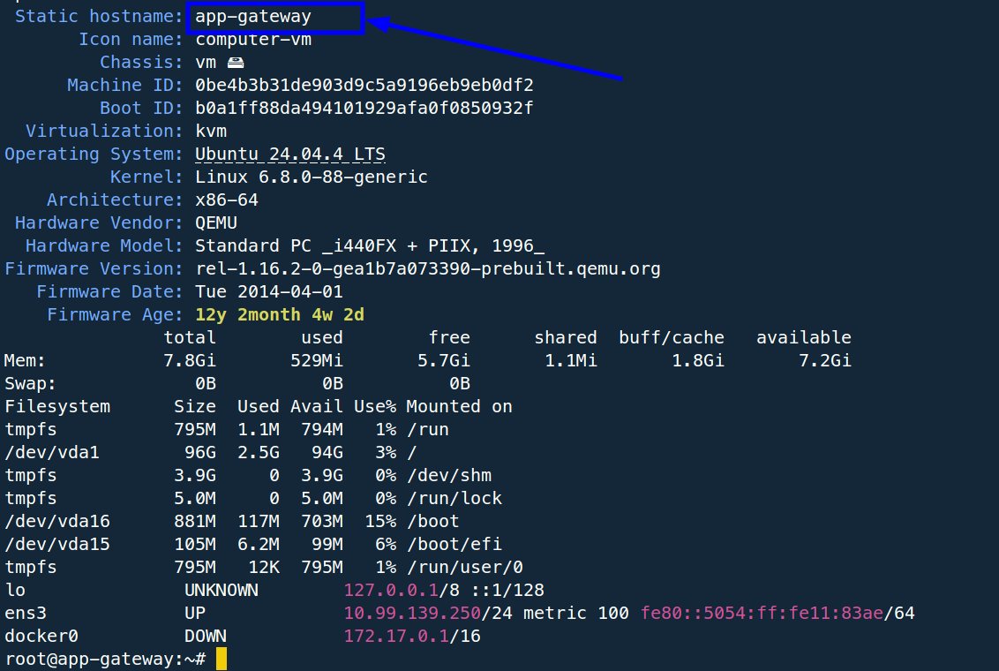
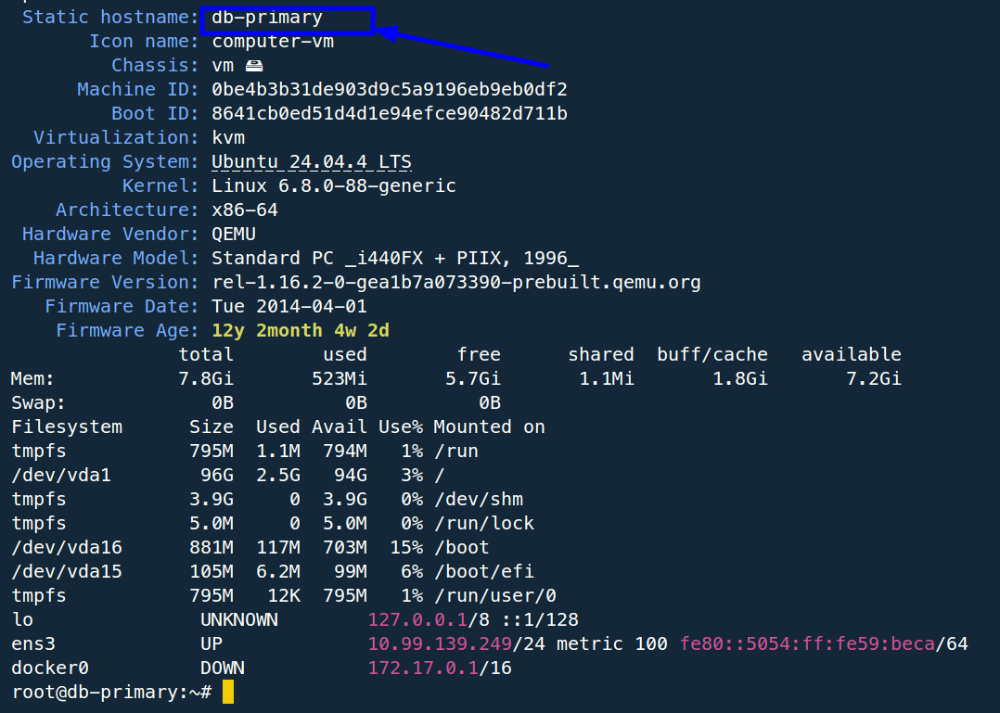
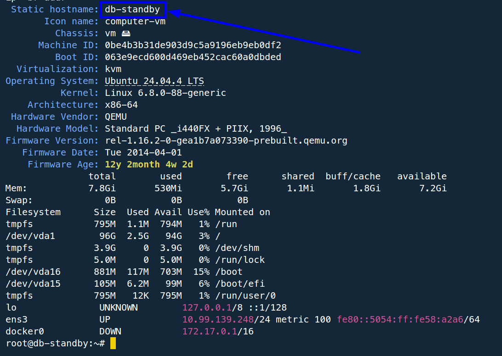
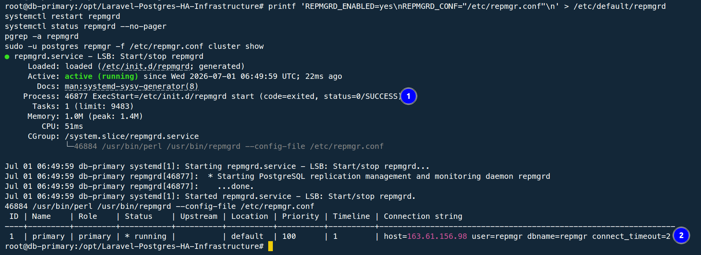
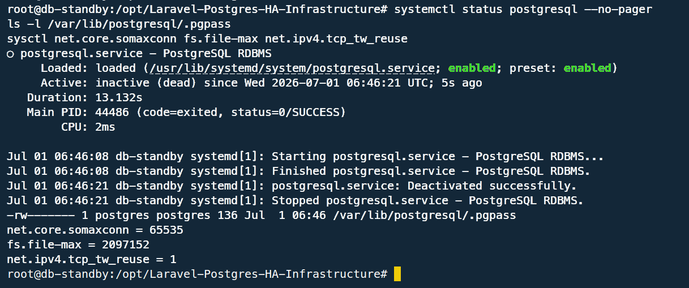
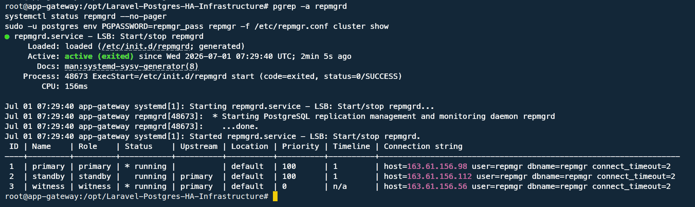
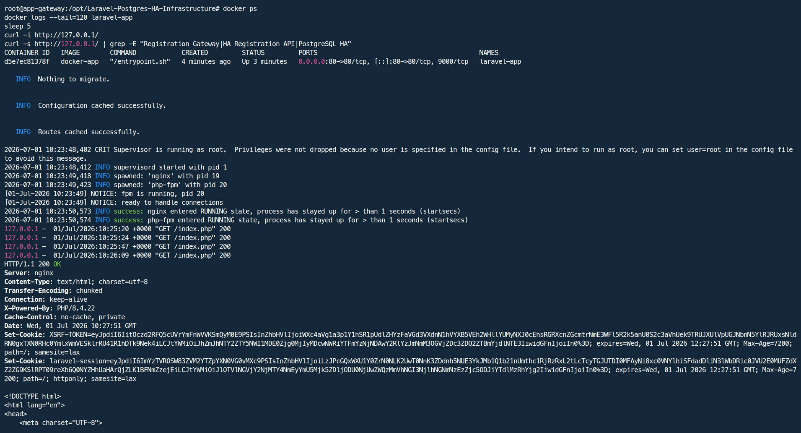

# Deployment and Reproduction Guide

## Environment

The assessment was executed on three Ubuntu 24.04.4 LTS virtual machines.

| VM | Hostname | IP | Role |
| --- | --- | --- | --- |
| VM-1 | `app-gateway` | `163.61.156.56` | Application gateway, PgBouncer, witness |
| VM-2 | `db-primary` | `163.61.156.98` | Initial PostgreSQL primary |
| VM-3 | `db-standby` | `163.61.156.112` | Initial PostgreSQL standby |

## Baseline Evidence

VM capacity and hostname/IP validation were captured before service deployment.







## Hostname Setup

Run on each VM:

```bash
hostnamectl set-hostname app-gateway   # VM-1
hostnamectl set-hostname db-primary    # VM-2
hostnamectl set-hostname db-standby    # VM-3
```

Add the cluster host mapping to `/etc/hosts`:

```text
163.61.156.56   app-gateway
163.61.156.98   db-primary
163.61.156.112  db-standby
```

## Repository Bootstrap

Run on all three VMs:

```bash
apt-get update -y
apt-get install -y git
cd /opt
git clone https://github.com/jotyprokash/Laravel-Postgres-HA-Infrastructure.git
cd Laravel-Postgres-HA-Infrastructure
git log --oneline -1
```

## Provisioning Order

### 1. Security Hardening

Run on VM-1:

```bash
bash executables/00_security_hardening.sh app
```

Run on VM-2 and VM-3:

```bash
bash executables/00_security_hardening.sh db
```

### 2. PostgreSQL Primary

Run on VM-2:

```bash
bash executables/01_postgres_primary.sh
bash executables/03_repmgr_setup.sh primary
```

Primary registration evidence:



### 3. PostgreSQL Standby

Run on VM-3:

```bash
bash executables/02_postgres_standby.sh
bash executables/03_repmgr_setup.sh standby
```

Standby prerequisite evidence:



### 4. Witness

Run on VM-1:

```bash
bash executables/03_repmgr_setup.sh witness
```

Witness evidence:



### 5. Laravel and PgBouncer

Run on VM-1:

```bash
bash executables/04_app_deployment.sh
```

The Laravel container is built from a multi-stage Dockerfile:

- `composer:2` creates a fresh Laravel application and installs dependencies.
- `php:8.4-fpm` runs the application with Nginx, Supervisor, and PostgreSQL extensions.
- Runtime configuration is provided by Docker Compose environment variables.

Application proof:



## Domain and HTTPS

Cloudflare DNS was configured with:

```text
app.jotysdevsecopslab.xyz -> 163.61.156.56
Proxy status: Proxied
SSL/TLS mode: Flexible
```

Cloudflare terminates public HTTPS and forwards to the VM-1 HTTP origin. For production hardening, the next step is Cloudflare Full Strict with an origin certificate or a host-level TLS proxy.

Domain evidence:


## Fresh Environment Reproduction Checklist

1. Set hostnames and `/etc/hosts`.
2. Clone the repository on all VMs.
3. Run security hardening scripts.
4. Provision VM-2 as PostgreSQL primary.
5. Provision VM-3 as PostgreSQL standby.
6. Register VM-1 as repmgr witness.
7. Deploy PgBouncer and Laravel on VM-1.
8. Configure Cloudflare DNS.
9. Validate API writes and replication.
10. Validate controlled failover.
11. Run load test.
