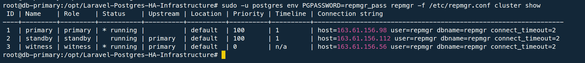

# High Availability and Failover

## HA Design

PostgreSQL high availability is implemented with:

- native PostgreSQL 16 streaming replication,
- `repmgr` for cluster metadata and promotion,
- `repmgrd` on database nodes,
- a witness node on VM-1,
- PgBouncer on VM-1 as the application database endpoint.

Initial topology:

```text
VM-2 db-primary  -> PostgreSQL primary
VM-3 db-standby  -> PostgreSQL standby
VM-1 app-gateway -> repmgr witness + PgBouncer
```

## Replication Verification

Replication was verified from the original primary and standby.


The witness was also registered to provide quorum.




## Failover Strategy

The assessment allows either automatic or documented failover. This deployment validates a controlled failover runbook:

1. Stop the original primary on VM-2.
2. Promote VM-3 with `repmgr standby promote`.
3. Repoint PgBouncer from VM-2 to VM-3.
4. Verify the Laravel API still accepts writes.
5. Rejoin the old primary as a standby from the new primary.

The repository also includes an `event_notification_command` hook:

```text
event_notification_command='/usr/local/bin/failover_pgbouncer.sh %n %e'
```

For this assessment run, PgBouncer was repointed through the controlled runbook so the failover sequence remained explicit, auditable, and safe. The repository also includes the notification hook for automated PgBouncer repointing; in production, that hook should be enabled with a locked-down SSH key and a sudoers rule limited to editing/reloading PgBouncer.

## Pre-Failover Health

Before failover, VM-2 was primary, VM-3 was streaming as standby, PgBouncer pointed to VM-2, and the public HTTPS endpoint returned success.


## Controlled Promotion

VM-2 PostgreSQL was stopped to simulate primary loss. VM-3 was then promoted.

```bash
# VM-2
systemctl stop repmgrd
systemctl stop postgresql
systemctl status postgresql --no-pager

# VM-3
sudo -u postgres repmgr -f /etc/repmgr.conf standby promote --log-to-file --force
sudo -u postgres repmgr -f /etc/repmgr.conf cluster show
sudo -u postgres psql -c "SELECT pg_is_in_recovery();"
```

Promotion evidence:


## PgBouncer Repoint

After promotion, PgBouncer on VM-1 was repointed to the promoted primary.

```bash
grep '^laravel_app' /etc/pgbouncer/pgbouncer.ini

sudo sed -i 's/host=163.61.156.98/host=163.61.156.112/' /etc/pgbouncer/pgbouncer.ini
systemctl reload pgbouncer

grep '^laravel_app' /etc/pgbouncer/pgbouncer.ini

PGPASSWORD=laravel_pass psql -h 127.0.0.1 -p 6432 -U laravel_db -d laravel_app \
  -c "SELECT inet_server_addr(), current_database(), current_user;"
```

PgBouncer repoint evidence:


## Application Write After Failover

The public HTTPS API accepted writes after failover and the row was present on the promoted primary.

```bash
curl -i -X POST https://app.jotysdevsecopslab.xyz/api/register \
  -H "Content-Type: application/json" \
  -H "Accept: application/json" \
  -d '{"username":"failover_test_001","email":"failover_test_001@example.com","name":"Failover Test","phone":"+8801000000004"}'
```

Evidence:


## Old Primary Rejoin

After VM-3 became primary and accepted writes, VM-2 was not restarted as a primary. That would risk split-brain. VM-2 was recloned from VM-3 and rejoined as a standby.

```bash
# VM-2
systemctl stop repmgrd || true
systemctl stop postgresql || true
sudo -u postgres rm -rf /var/lib/postgresql/16/main

sudo -u postgres repmgr -h 163.61.156.112 -U repmgr -d repmgr \
  -f /etc/repmgr.conf standby clone --fast-checkpoint --force

pg_ctlcluster 16 main start
sudo -u postgres repmgr -f /etc/repmgr.conf standby register --force

sudo -u postgres psql -c "ALTER SYSTEM SET primary_conninfo = 'host=163.61.156.112 port=5432 user=repmgr password=repmgr_pass application_name=primary connect_timeout=2';"
pg_ctlcluster 16 main restart
```

Rejoin evidence:


## Final HA State

```text
VM-3 db-standby  -> active primary
VM-2 db-primary  -> standby following VM-3
VM-1 app-gateway -> PgBouncer points to VM-3
```
