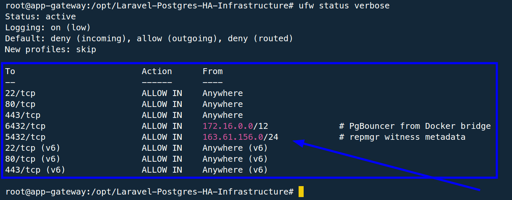
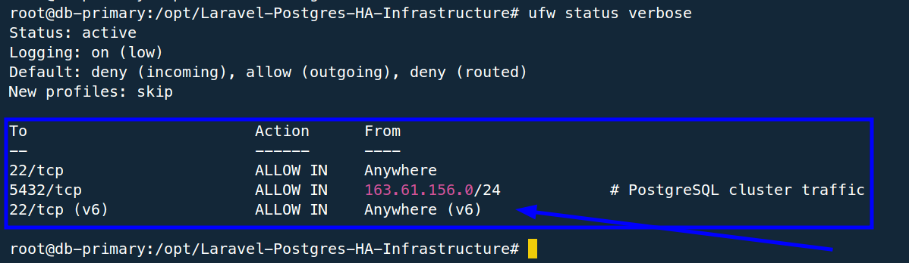
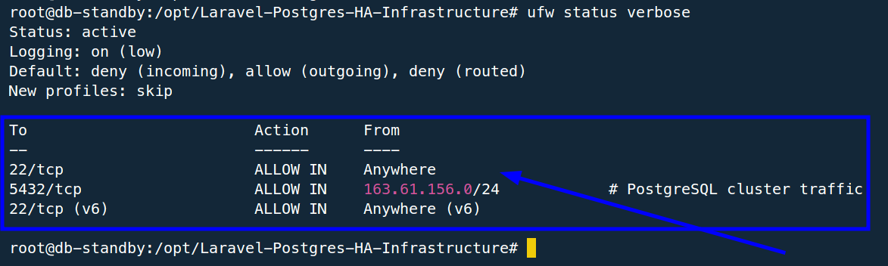

# Security Controls

## Network Firewall

UFW was enabled on all VMs with default deny incoming and allow outgoing.

VM-1 app gateway allows:

- SSH `22/tcp`,
- HTTP/HTTPS `80/tcp`, `443/tcp`,
- PgBouncer `6432/tcp` from Docker bridge range,
- PostgreSQL `5432/tcp` from the cluster CIDR for witness/repmgr metadata.

VM-2 and VM-3 database nodes allow:

- SSH `22/tcp`,
- PostgreSQL `5432/tcp` only from the cluster CIDR.

Evidence:







## Database Access Control

PostgreSQL access is restricted through `pg_hba.conf`.

Important access patterns:

```text
laravel_db  -> laravel_app from VM-1 only
repmgr      -> repmgr metadata and replication from cluster subnet
replication -> repmgr from cluster subnet
```

The Laravel application does not connect as `postgres` or `repmgr`. It uses a dedicated application user:

```text
database: laravel_app
user:     laravel_db
```

## PgBouncer Authentication

PgBouncer is configured with an MD5 userlist for the `laravel_db` application user and transaction pooling. PostgreSQL stores the Laravel user password in MD5 format to match PgBouncer's authentication flow.

## Least Privilege

Users are separated by responsibility:

| User | Scope |
| --- | --- |
| `postgres` | Local PostgreSQL system administration |
| `repmgr` | Replication and repmgr metadata |
| `laravel_db` | Laravel application database writes |
| `root` | Assessment bootstrap access only |

For a production handoff, root SSH should be disabled after key-based non-root access is installed.

## Application File Permissions

The Docker image applies ownership to the Laravel runtime tree:

```Dockerfile
COPY --from=laravel-build --chown=www-data:www-data /app /var/www/html
chmod -R 775 /var/www/html/storage /var/www/html/bootstrap/cache
```

Only Laravel writable directories are made group-writable.

## Public HTTPS

Cloudflare was used for proxied public HTTPS:

```text
app.jotysdevsecopslab.xyz -> Cloudflare proxy -> VM-1 origin
```

Evidence:


Current assessment mode:

```text
Cloudflare SSL/TLS: Flexible
Origin VM-1: HTTP
```

This gives browser-facing HTTPS and was sufficient for assessment validation. Production hardening should move to:

```text
Cloudflare SSL/TLS: Full Strict
Origin: valid Cloudflare origin certificate or Let's Encrypt certificate
Nginx/Caddy: listens on 443
Laravel: trusted proxy headers configured
```

## SSH Hardening Notes

The assessment started from provided root credentials. The security script enables firewalling and preserves SSH access for the live evaluation.

Recommended production handoff:

1. Create a non-root `deployer` user.
2. Install SSH public keys.
3. Disable password login.
4. Disable root SSH login.
5. For automatic PgBouncer failover, allow a restricted SSH key from VM-3 `postgres` to VM-1 with a sudoers rule limited to the PgBouncer update/reload command.
