# Validation Matrix

This document maps the assessment requirements to the implemented system and the captured evidence.

## Requirement Coverage

| Assessment area | Implemented proof |
| --- | --- |
| Architecture diagram | `architecture.svg` in the repository and the README |
| Application server | VM-1 runs Dockerized Laravel, Nginx, PHP-FPM, and PgBouncer |
| PostgreSQL HA cluster | VM-3 is the active primary after failover, VM-2 rejoined as standby |
| Replication strategy | Asynchronous PostgreSQL streaming replication managed by repmgr |
| Failover mechanism | Controlled repmgr promotion plus PgBouncer database target update |
| Laravel deployment | Browser UI and `/api/register` endpoint deployed behind public HTTPS |
| Database connectivity | Laravel writes through PgBouncer to PostgreSQL |
| Security | UFW, restricted PostgreSQL access, dedicated DB users, Cloudflare proxy |
| Load validation | 100,000 registration writes with 1,000 concurrent clients completed with HTTP 201 responses |

## Baseline Cluster State

Before failover and load validation, the cluster had one primary, one standby, and one witness:

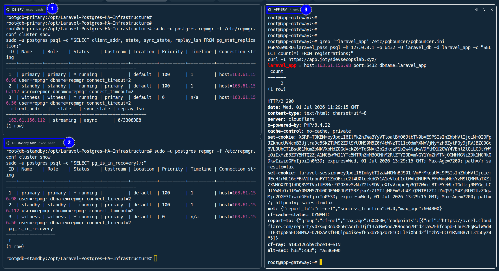

## Laravel To PostgreSQL Write Validation

The registration endpoint accepts JSON payloads and writes to the `registrations` table.

```bash
curl -i -X POST http://127.0.0.1/api/register \
  -H "Content-Type: application/json" \
  -H "Accept: application/json" \
  -d '{"username":"sre_test_001","email":"sre_test_001@example.com","name":"SRE Test User","phone":"+8801000000001"}'

PGPASSWORD=laravel_pass psql -h 127.0.0.1 -p 6432 -U laravel_db -d laravel_app \
  -c "SELECT id, username, email, created_at FROM registrations WHERE username='sre_test_001';"
```

The same row was visible on the standby while it was in recovery mode:

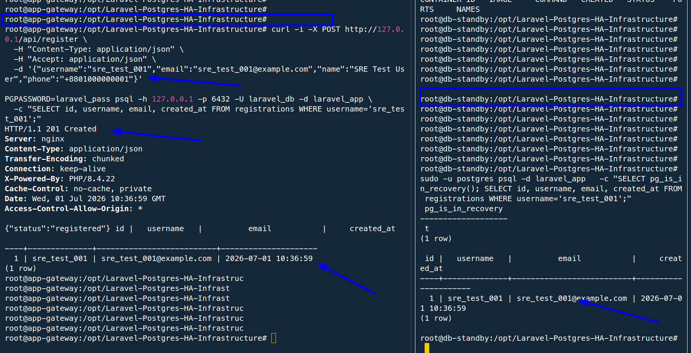

## Public HTTPS Validation

The app is reachable through Cloudflare-proxied HTTPS:

```bash
curl -I https://app.jotysdevsecopslab.xyz/
```

Evidence:

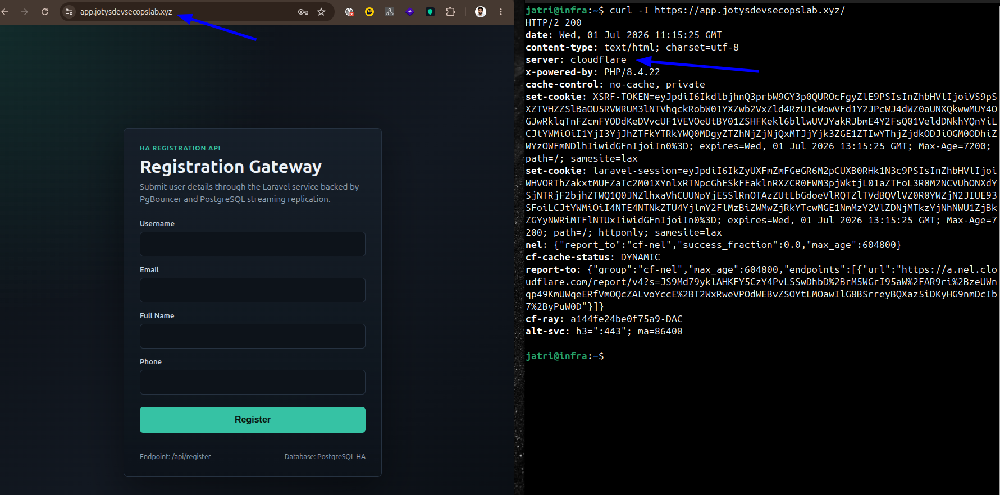

### Edge Protocol Validation

Browser DevTools confirmed that the public document request is served over HTTP/3 at the Cloudflare edge:

```text
app.jotysdevsecopslab.xyz -> 200 -> h3
```

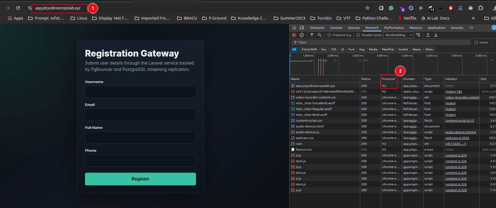

The terminal check returned HTTP/2:

```text
curl -I https://app.jotysdevsecopslab.xyz/ -> HTTP/2 200
```

Both results are valid. Cloudflare negotiates HTTP/3 with capable browsers, while clients that do not support HTTP/3, including the installed curl build on the workstation, fall back to HTTP/2. This validates HTTP/3 edge delivery without losing compatibility for HTTP/2 clients.

A write through the public HTTPS domain also reached PostgreSQL and replicated:

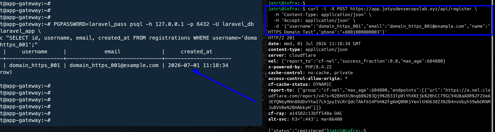

## Replication Validation

On the active primary:

```bash
sudo -u postgres psql -c \
  "SELECT client_addr, state, sync_state, replay_lsn FROM pg_stat_replication;"
```

On the standby:

```bash
sudo -u postgres psql -c "SELECT pg_is_in_recovery();"
```

Evidence:

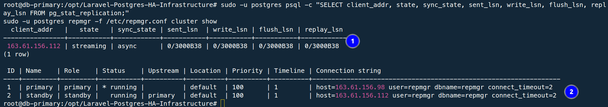

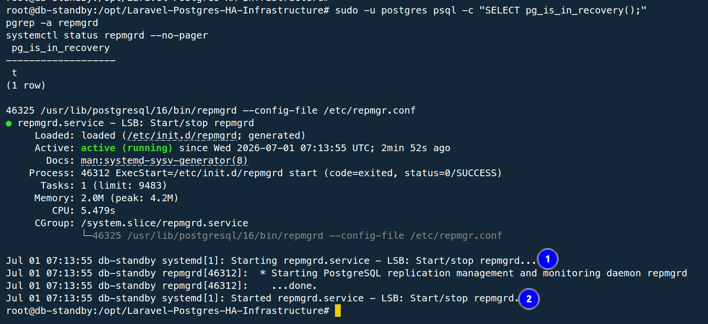

## Failover Validation

The original primary was stopped to simulate primary database failure:

```bash
systemctl stop repmgrd
systemctl stop postgresql
systemctl status postgresql --no-pager
```

The standby was promoted:

```bash
sudo -u postgres repmgr -f /etc/repmgr.conf standby promote --log-to-file --force
sudo -u postgres repmgr -f /etc/repmgr.conf cluster show
sudo -u postgres psql -c "SELECT pg_is_in_recovery();"
```

Evidence:

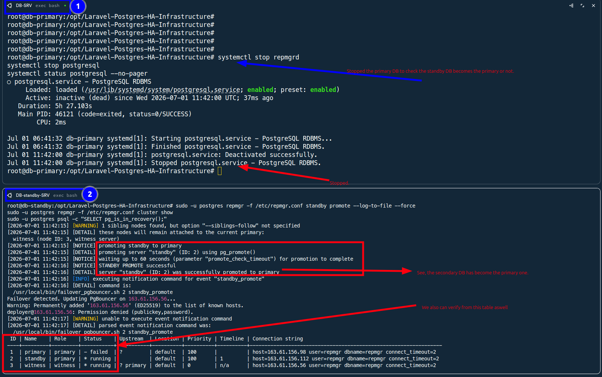

PgBouncer was then repointed from the failed primary to the promoted primary:

```bash
sudo sed -i 's/host=163.61.156.98/host=163.61.156.112/' /etc/pgbouncer/pgbouncer.ini
systemctl reload pgbouncer

PGPASSWORD=laravel_pass psql -h 127.0.0.1 -p 6432 -U laravel_db -d laravel_app \
  -c "SELECT inet_server_addr(), current_database(), current_user;"
```

Evidence:

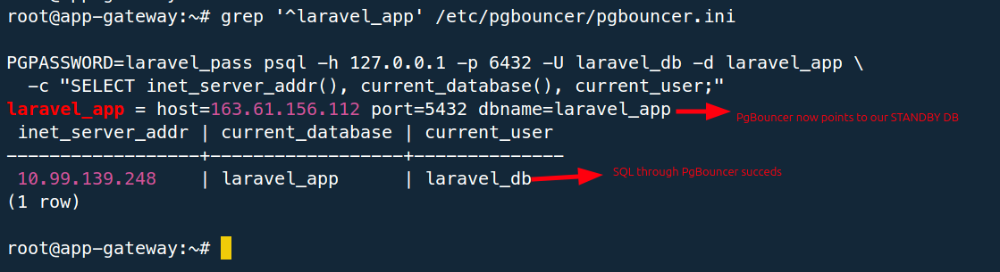

The application remained writable after failover:

```bash
curl -i -X POST https://app.jotysdevsecopslab.xyz/api/register \
  -H "Content-Type: application/json" \
  -H "Accept: application/json" \
  -d '{"username":"failover_test_001","email":"failover_test_001@example.com","name":"Failover Test","phone":"+8801000000004"}'
```

Evidence:

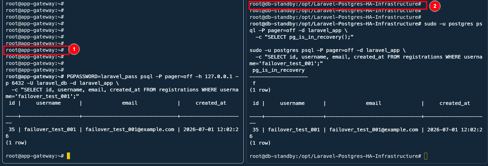

## Rejoin Validation

The old primary was recloned and rejoined as a standby following the promoted primary:

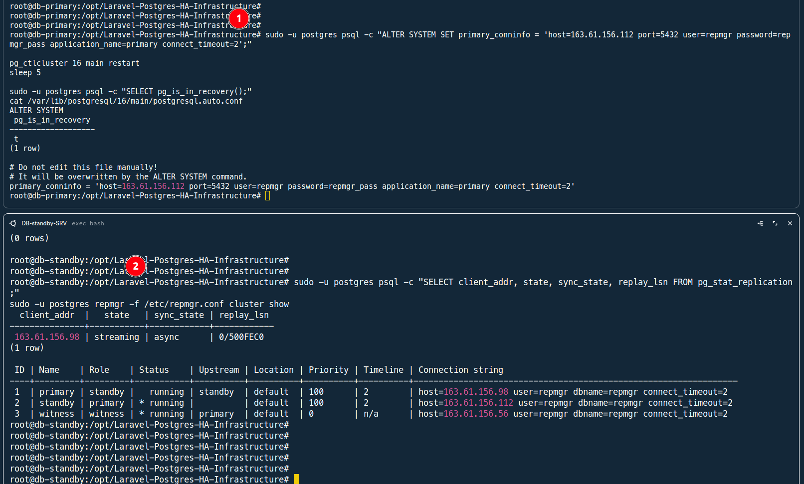

## Load Validation

The registration endpoint was tested locally from VM-1 to avoid external network noise:

```bash
hey -n 100000 -c 1000 -m POST \
  -H "Content-Type: application/json" \
  -H "Accept: application/json" \
  -d "$(cat /tmp/register_payload.json)" \
  http://127.0.0.1/api/register
```

Result:

```text
Total requests: 100000
Concurrency:    1000
Success:        100000 HTTP 201 responses
Throughput:     201.8751 requests/sec
Average:        4.9306 sec
P95 latency:    5.3170 sec
P99 latency:    5.4676 sec
```

Evidence:

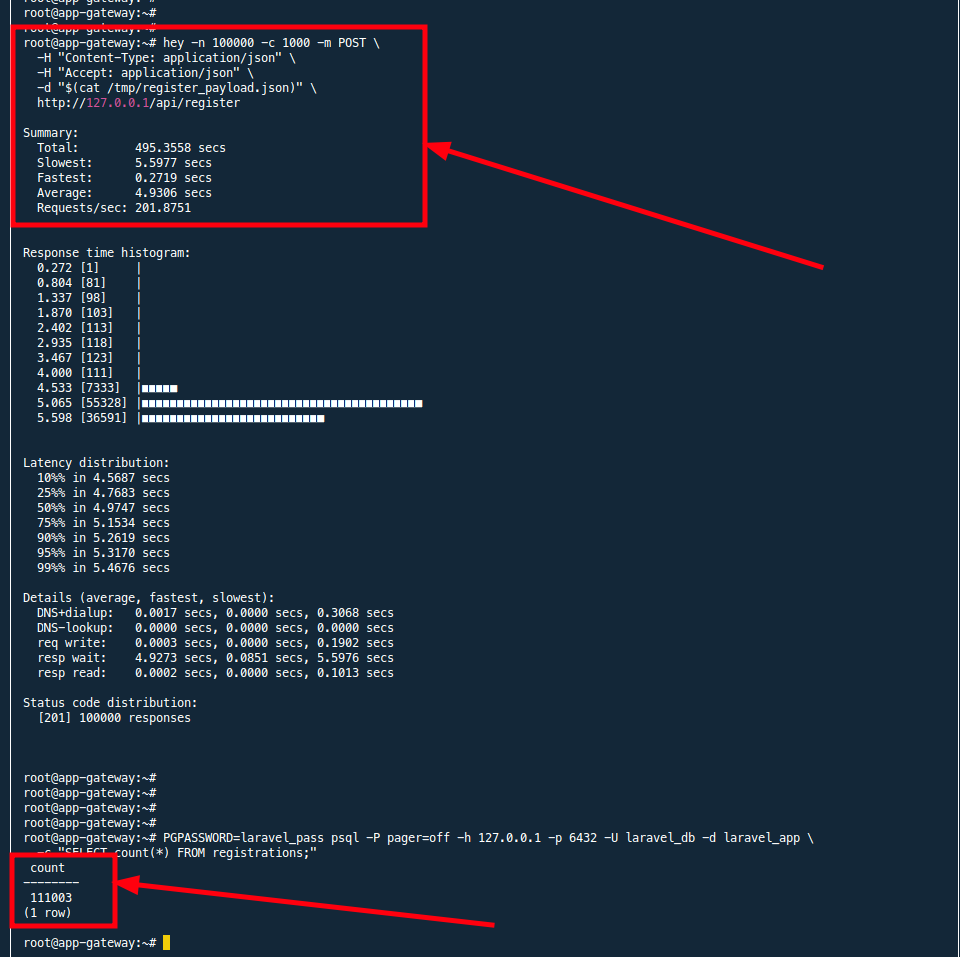

Post-load cluster health was also checked:

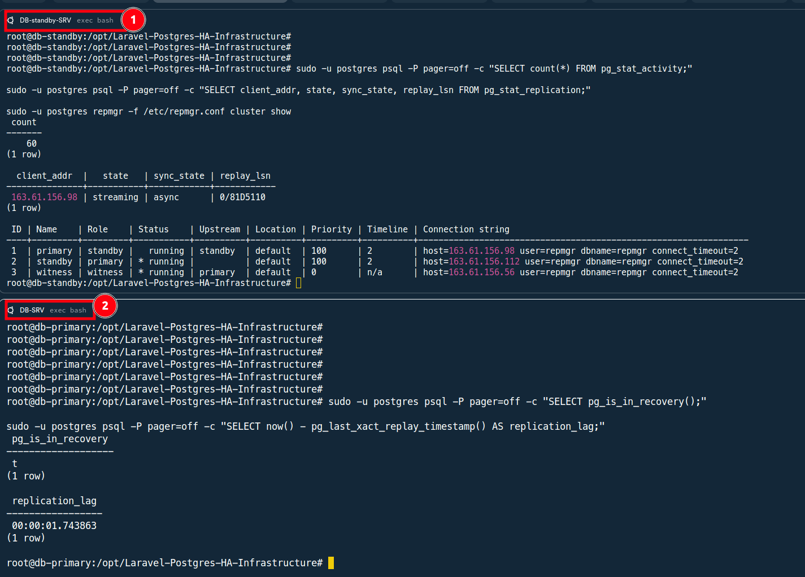

## Notes On 100K/s

The system successfully demonstrated the required endpoint under a 100K-request load. Sustained 100K writes/sec is a different capacity target and would require larger compute, higher IOPS storage, horizontal application workers, distributed load generators, and likely queue or batch ingestion design. This is documented in [database_optimization.md](database_optimization.md).
